# Домашнее задание к занятию 4 «Оркестрация группой Docker контейнеров на примере Docker Compose» - Иванов Дмитрий (fops-13)

### Инструкция к выполению

1. Для выполнения заданий обязательно ознакомьтесь с [инструкцией](https://github.com/netology-code/devops-materials/blob/master/cloudwork.MD) по экономии облачных ресурсов. Это нужно, чтобы не расходовать средства, полученные в результате использования промокода.
2. Практические задачи выполняйте на личной рабочей станции или созданной вами ранее ВМ в облаке.
3. Своё решение к задачам оформите в вашем GitHub репозитории в формате markdown!!!
4. В личном кабинете отправьте на проверку ссылку на .md-файл в вашем репозитории.

## Задача 1

Сценарий выполнения задачи:
- Установите docker и docker compose plugin на свою linux рабочую станцию или ВМ.
- Зарегистрируйтесь и создайте публичный репозиторий  с именем "custom-nginx" на https://hub.docker.com;
- скачайте образ nginx:1.21.1;
- Создайте Dockerfile и реализуйте в нем замену дефолтной индекс-страницы(/usr/share/nginx/html/index.html), на файл index.html с содержимым:
```
<html>
<head>
Hey, Netology
</head>
<body>
<h1>I will be DevOps Engineer!</h1>
</body>
</html>
```
- Соберите и отправьте созданный образ в свой dockerhub-репозитории c tag 1.0.0 . 
- Предоставьте ответ в виде ссылки на https://hub.docker.com/<username_repo>/custom-nginx/general .


## Решение задачи 1

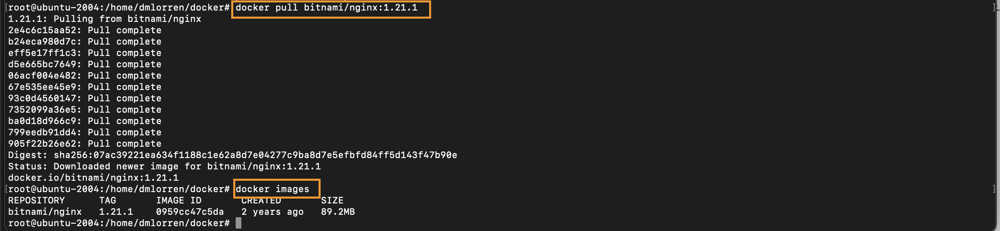
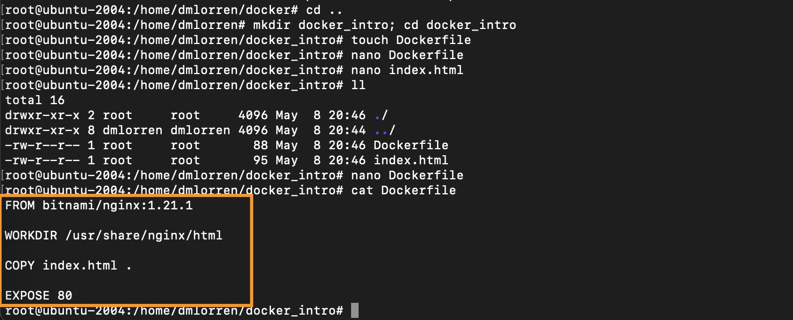

1. При нахождении в папке с Dockerfile собираем docker-образ из этого же самого Docker-файла:
```
root@ubuntu-2004:/home/dmlorren/docker_intro# docker build -t my_nginx
```
2. Берём наш локально собранный образ (my_nginx:latest) и присваиваем ему удалённый репозиторий (туда куда хотим загрузить в нашем случае docker hub) и тэг с котороым он будет отображаться:
```
root@ubuntu-2004:/home/dmlorren/docker_intro# docker tag my_nginx:latest dmlorren/custom-nginx:v.1.0.0
```
3. Теперь уже подготовленный образ загружаем в докер-хаб (не забываем предварительно залогиниться в docker hub и ввести свой токен):
```
root@ubuntu-2004:/home/dmlorren/docker_intro# docker push dmlorren/custom-nginx:v.1.0.0
```

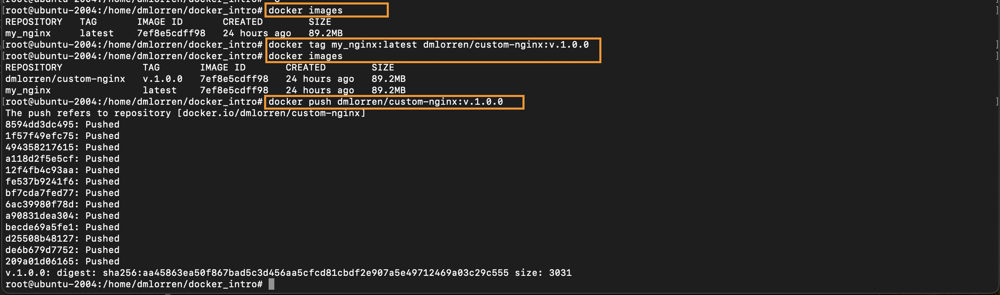
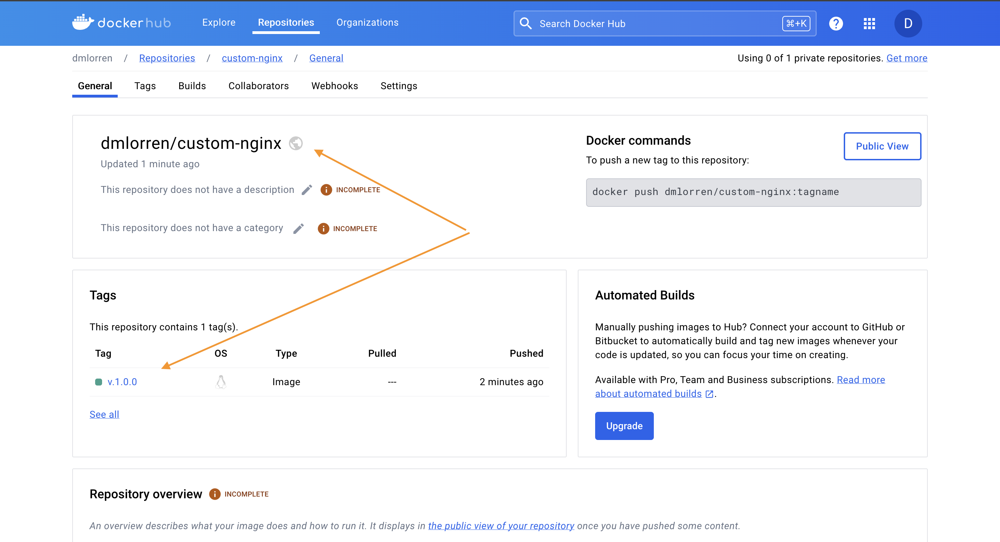

шпаргалка:
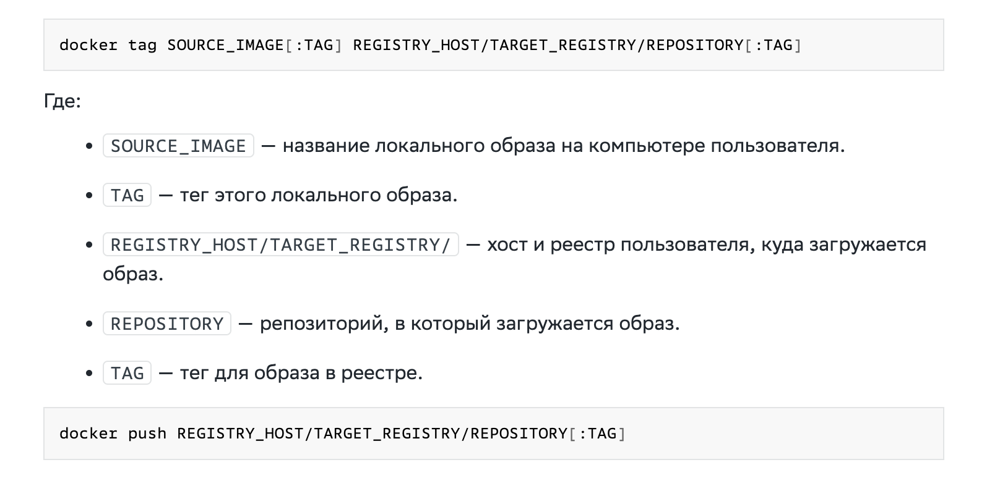

ссылка на репозиторий docker hub:
https://hub.docker.com/repository/docker/dmlorren/custom-nginx/general


---


## Задача 2
1. Запустите ваш образ custom-nginx:1.0.0 командой docker run в соответствии с требованиями:
- имя контейнера "ФИО-custom-nginx-t2"
- контейнер работает в фоне
- контейнер опубликован на порту хост системы 127.0.0.1:8080
2. Переименуйте контейнер в "custom-nginx-t2"
3. Выполните команду ```date +"%d-%m-%Y %T.%N %Z" ; sleep 0.150 ; docker ps ; ss -tlpn | grep 127.0.0.1:8080  ; docker logs custom-nginx-t2 -n1 ; docker exec -it custom-nginx-t2 base64 /usr/share/nginx/html/index.html```
4. Убедитесь с помощью curl или веб браузера, что индекс-страница доступна.

В качестве ответа приложите скриншоты консоли, где видно все введенные команды и их вывод.


## Решение задачи 2

В данном задании столкнулся с двумя проблемами:
1. При запуске контейнера:
```
exec /opt/bitnami/scripts/nginx/entrypoint.sh: exec format error
```

```text
1. Cобственно я запускаю контейнер для amd64 в архитектуре arm, так как работаю на mac m1 с гипервизором vmware fusion и в нём стоит убунта arm64. С помощью stackoverflow познакомился с таким понятием как сборщик, отобразил это на скриншотах. Собрал новую мультиплатформенную сборку по тегом v.1.0.1 и спустя двое полноценных суток так и не смог нормально запустить контейнер. В виду того, что время горит, мигрировал с макбука на свой основной компьютер под windows и взял образ убунты amd64.

2. После переезда в архитектуру amd64 новая проблема стала заключаться в следующем в vm и с поднятым докер контейнером не отрабатывает команда curl и возвращает 56 ошибку с отказом подключения. Помогло вот что, я когда в искал образ nginx с конкретной версией,то не нашёл глазами его в докер хабе и взял образ в репозитории bitnami, возможно проблема была именно в этом.. решил отредактировать Dockerfile,чтобы остался оригинальный nginx, после всё пересобрал и запустил - помогло.
```

эксперименты:
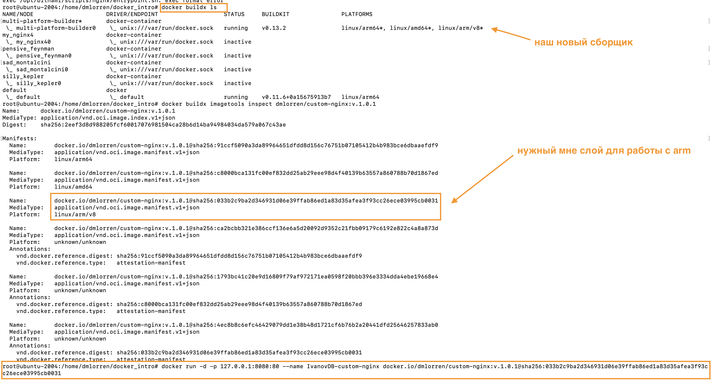

- Рабочая версия (после переезда в винду):
```
docker build --tag dmlorren/custom-nginx:v.1.0.2 -f Dockerfile .
docker push dmlorren/custom-nginx:v.1.0.2
docker run -d -p 127.0.0.1:8080:80 --name Ivanov-custom-nginx-t2 docker.io/dmlorren/custom-nginx:v.1.0.2
```

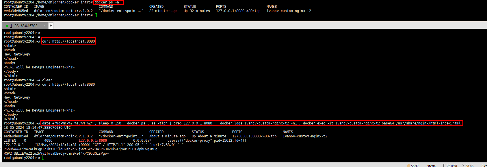

---


## Задача 3
1. Воспользуйтесь docker help или google, чтобы узнать как подключиться к стандартному потоку ввода/вывода/ошибок контейнера "custom-nginx-t2".
2. Подключитесь к контейнеру и нажмите комбинацию Ctrl-C.
3. Выполните ```docker ps -a``` и объясните своими словами почему контейнер остановился.
4. Перезапустите контейнер
5. Зайдите в интерактивный терминал контейнера "custom-nginx-t2" с оболочкой bash.
6. Установите любимый текстовый редактор(vim, nano итд) с помощью apt-get.
7. Отредактируйте файл "/etc/nginx/conf.d/default.conf", заменив порт "listen 80" на "listen 81".
8. Запомните(!) и выполните команду ```nginx -s reload```, а затем внутри контейнера ```curl http://127.0.0.1:80 ; curl http://127.0.0.1:81```.
9. Выйдите из контейнера, набрав в консоли  ```exit``` или Ctrl-D.
10. Проверьте вывод команд: ```ss -tlpn | grep 127.0.0.1:8080``` , ```docker port custom-nginx-t2```, ```curl http://127.0.0.1:8080```. Кратко объясните суть возникшей проблемы.
11. * Это дополнительное, необязательное задание. Попробуйте самостоятельно исправить конфигурацию контейнера, используя доступные источники в интернете. Не изменяйте конфигурацию nginx и не удаляйте контейнер. Останавливать контейнер можно. [пример источника](https://www.baeldung.com/linux/assign-port-docker-container)
12. Удалите запущенный контейнер "custom-nginx-t2", не останавливая его.(воспользуйтесь --help или google)

В качестве ответа приложите скриншоты консоли, где видно все введенные команды и их вывод.


## Решение задачи 3

С помощью "docker attach" подключаемся к запущенному контейнеру и взаимодействуем с его стандартным вводом/выводом.

```
docker attach eeda9de805ed
docker ps -a
docker start eeda9de805ed
docker exec -it eeda9de805ed bash
```
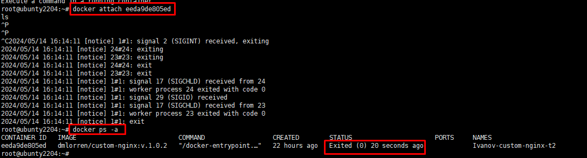

```text
  Через CTRL-С мы отправляем SIGINT (2) сигнал прерывания, тем самым останавливаем контейнер.
```

Ставим midnight commander:
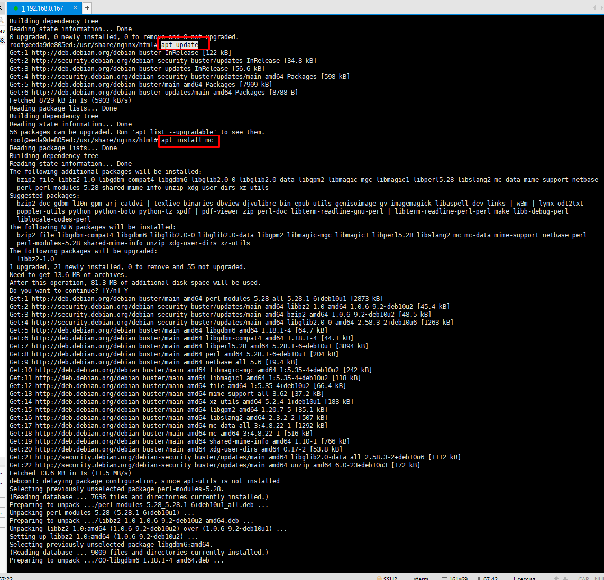

Подключаемся к запущенному контейнеру, отправляем SIG, запускаем по новой, подключаемся с оболочкой bash:
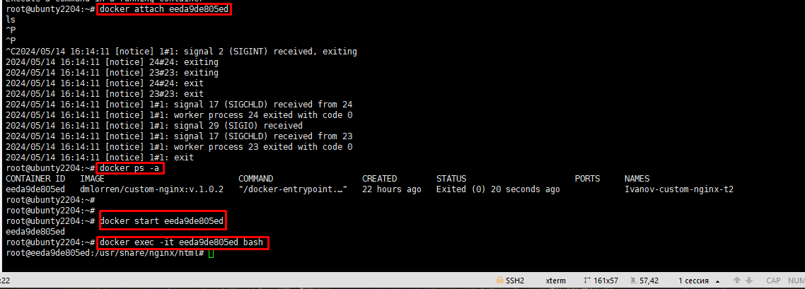

Редактируем "/etc/nginx/conf.d/default.conf", меняем порт, выполняем curl:
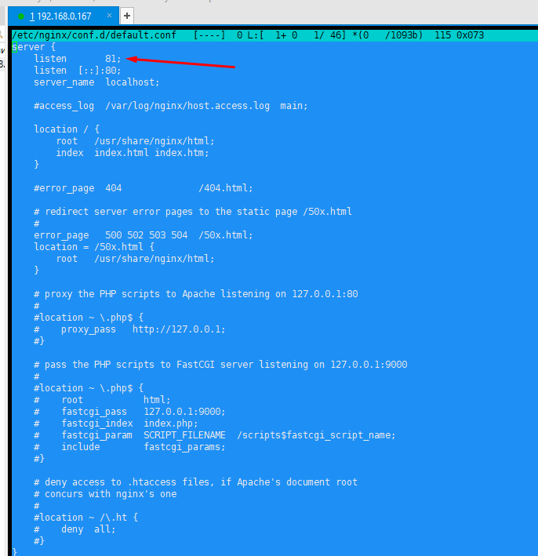
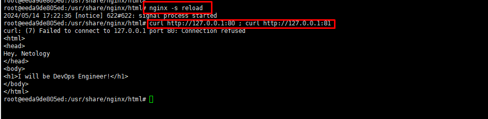

Анализируем проблему:
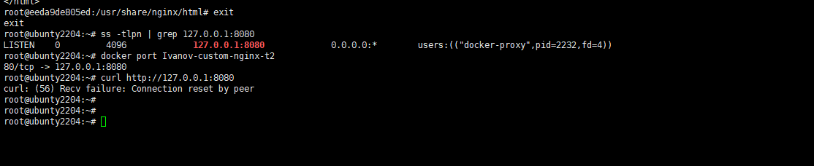

```text
Мы когда запускали контейнер, то сделали фиксированный проброс портов, с 8080 хоста (моя виртуалка) стучимся на 80 порт контейнера (а точнее сервиса который там запущен). А так как в предыдущем упражнении мы поменяли порт веб сервера nginx с 80 на 81, то соотвестветвенно curl не проходит, так как указанная при запуске мапа 8080 -> 80 сейчас не работает.
```

Удаляем контейнер без предварительной его остановки через docker rm -f:
```
docker rm -f eeda9de805ed
```


---

## Задача 4


- Запустите первый контейнер из образа ***centos*** c любым тегом в фоновом режиме, подключив папку  текущий рабочий каталог ```$(pwd)``` на хостовой машине в ```/data``` контейнера, используя ключ -v.
- Запустите второй контейнер из образа ***debian*** в фоновом режиме, подключив текущий рабочий каталог ```$(pwd)``` в ```/data``` контейнера. 
- Подключитесь к первому контейнеру с помощью ```docker exec``` и создайте текстовый файл любого содержания в ```/data```.
- Добавьте ещё один файл в текущий каталог ```$(pwd)``` на хостовой машине.
- Подключитесь во второй контейнер и отобразите листинг и содержание файлов в ```/data``` контейнера.

В качестве ответа приложите скриншоты консоли, где видно все введенные команды и их вывод.


## Решение задачи 4

```
docker run -d -v $(pwd):/data centos:7 tail -f /dev/null
docker run -d -v $(pwd):/data debian:11 tail -f /dev/null
docker exec -it e045acc2a6aa bash
echo "hello world" > /data/file_centos
docker exec -it b1d7b4a8f68a bash
echo "hello Netology" > /data/file_debian
echo "Hello My Hosts" > file_ubunty
docker exec -it b1d7b4a8f68a bash
ls -la /data/
```

Комментарий:
```text
-v $(pwd):/data: это запись флаг для монтирования тома, а именно:
-v: указывает Docker, что нужно смонтировать том;
$(pwd): переменная, возвращающая текущий рабочий каталог на хосте;
/data: точка монтирования внутри контейнера, т.е. текущий рабочий каталог на хосте будет доступен внутри контейнера по пути /data.


Для того чтобы контейнер не падал сразу, нужно, чтобы внутри крутилась какая-либо служба (в прошлом задании это был nginx) здесь я просто указал "tail -f /dev/null" таким образом получаем, что процесс чтения пустого файла никогда не завершится.
```
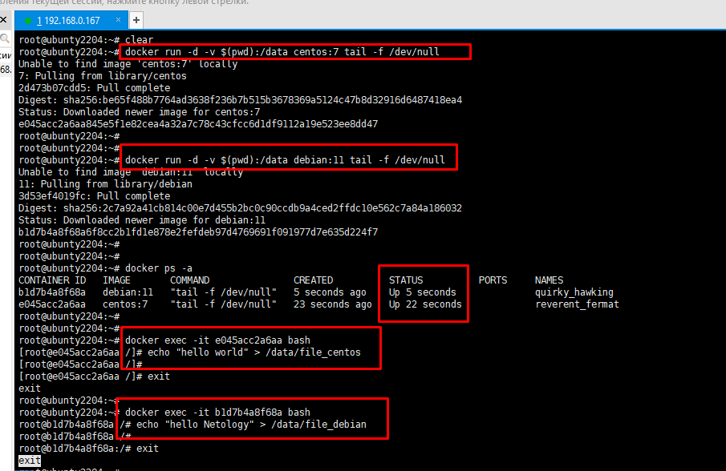
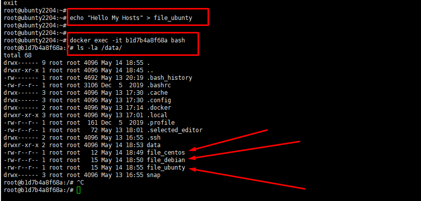


## Задача 5

1. Создайте отдельную директорию(например /tmp/netology/docker/task5) и 2 файла внутри него.
"compose.yaml" с содержимым:
```
version: "3"
services:
  portainer:
    image: portainer/portainer-ce:latest
    network_mode: host
    ports:
      - "9000:9000"
    volumes:
      - /var/run/docker.sock:/var/run/docker.sock
```
"docker-compose.yaml" с содержимым:
```
version: "3"
services:
  registry:
    image: registry:2
    network_mode: host
    ports:
    - "5000:5000"
```

И выполните команду "docker compose up -d". Какой из файлов был запущен и почему? (подсказка: https://docs.docker.com/compose/compose-application-model/#the-compose-file )

2. Отредактируйте файл compose.yaml так, чтобы были запущенны оба файла. (подсказка: https://docs.docker.com/compose/compose-file/14-include/)

3. Выполните в консоли вашей хостовой ОС необходимые команды чтобы залить образ custom-nginx как custom-nginx:latest в запущенное вами, локальное registry. Дополнительная документация: https://distribution.github.io/distribution/about/deploying/
4. Откройте страницу "https://127.0.0.1:9000" и произведите начальную настройку portainer.(логин и пароль адмнистратора)
5. Откройте страницу "http://127.0.0.1:9000/#!/home", выберите ваше local  окружение. Перейдите на вкладку "stacks" и в "web editor" задеплойте следующий компоуз:

```
version: '3'

services:
  nginx:
    image: 127.0.0.1:5000/custom-nginx
    ports:
      - "9090:80"
```
6. Перейдите на страницу "http://127.0.0.1:9000/#!/2/docker/containers", выберите контейнер с nginx и нажмите на кнопку "inspect". В представлении <> Tree разверните поле "Config" и сделайте скриншот от поля "AppArmorProfile" до "Driver".

7. Удалите любой из манифестов компоуза(например compose.yaml).  Выполните команду "docker compose up -d". Прочитайте warning, объясните суть предупреждения и выполните предложенное действие. Погасите compose-проект ОДНОЙ(обязательно!!) командой.

В качестве ответа приложите скриншоты консоли, где видно все введенные команды и их вывод, файл compose.yaml , скриншот portainer c задеплоенным компоузом.


## Решение задачи 5

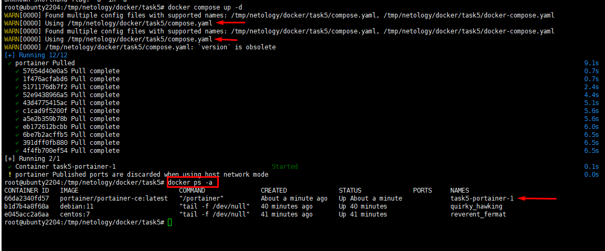

```text
Compose also supports docker-compose.yaml and docker-compose.yml for backwards compatibility of earlier versions. If both files exist, Compose prefers the canonical compose.yaml.

Поддерживается обратная совместимость, но по умолчанию используется compose.yaml.
```
Отредактируем наш файл:
root@ubunty2204:/tmp/netology/docker/task5# cat compose.yaml 

```yaml
version: "3"
include:
  - docker-compose.yaml

services:
  portainer:
    image: portainer/portainer-ce:latest
    network_mode: host
    ports:
      - "9000:9000"
    volumes:
      - /var/run/docker.sock:/var/run/docker.sock
```

```text
Через include мы подтянем все ресурсы указанные в "docker-compose.yaml", вообще подтягивание других (при их наличии) compose файлов через include позволяет повторно использовать ресурсы, упростить управление и совместное использование и упростить общую организацию compose файла, если он очень ресурсоёмкий, так как часть настроек по использованию ресурсов будет вынесена в другой файл. 
```

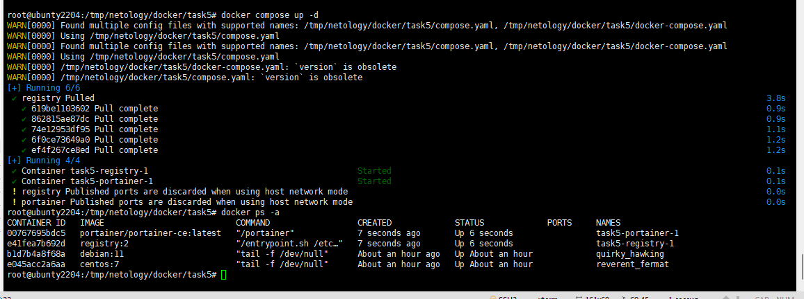

```
docker pull dmlorren/custom-nginx:v.1.0.2
docker tag dmlorren/custom-nginx:v.1.0.2 localhost:5000/custom-nginx:latest
docker push localhost:5000/custom-nginx:latest
```

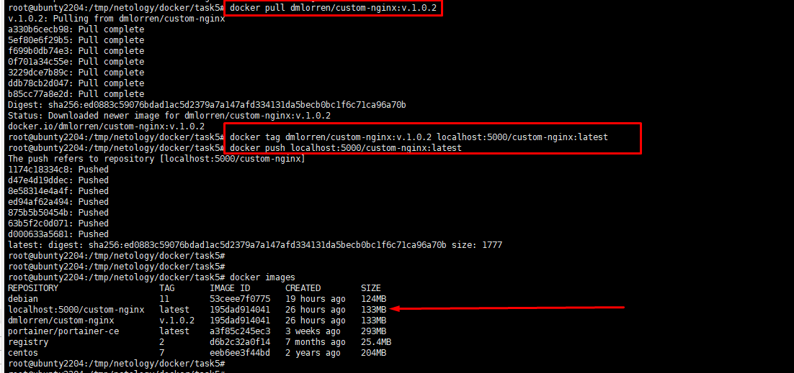

Ставим графику:
```
sudo apt install ubuntu-desktop
sudo apt install lightdm
sudo service lightdm start
```

Выполняем необходимые процедуры:

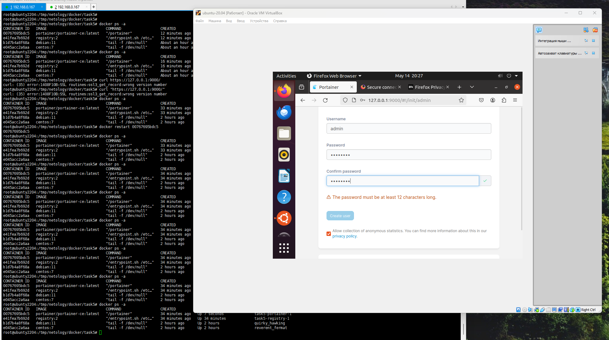
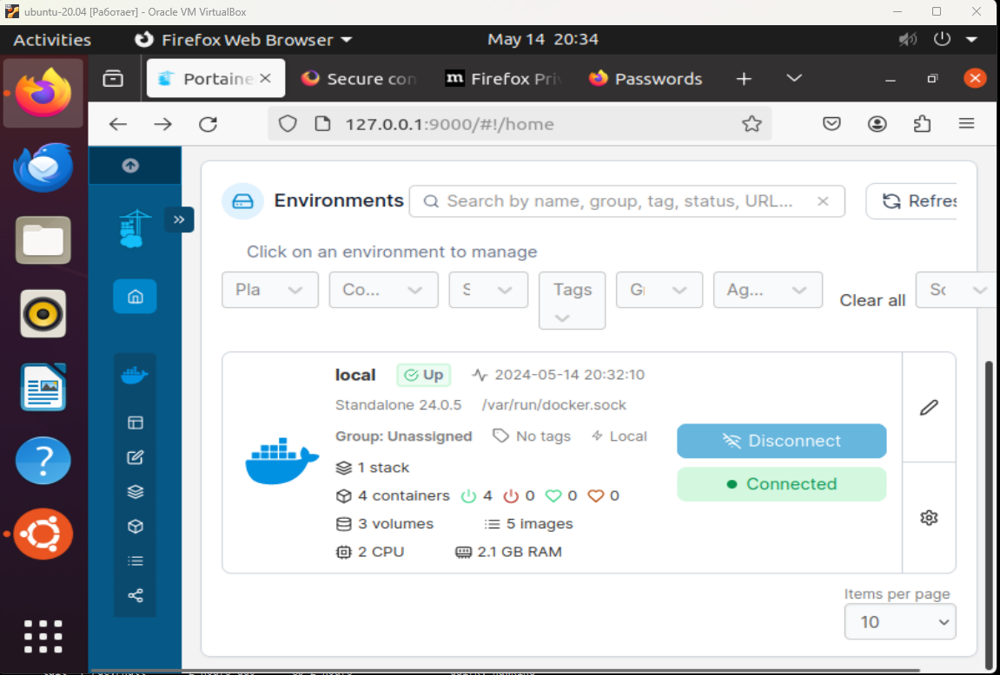
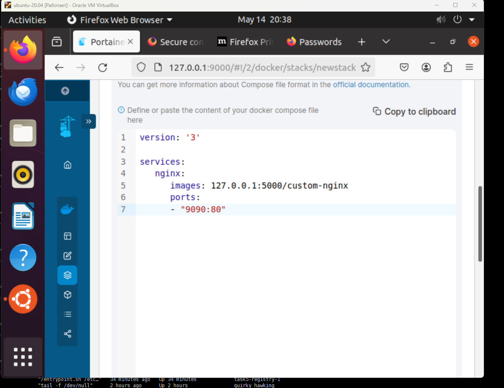
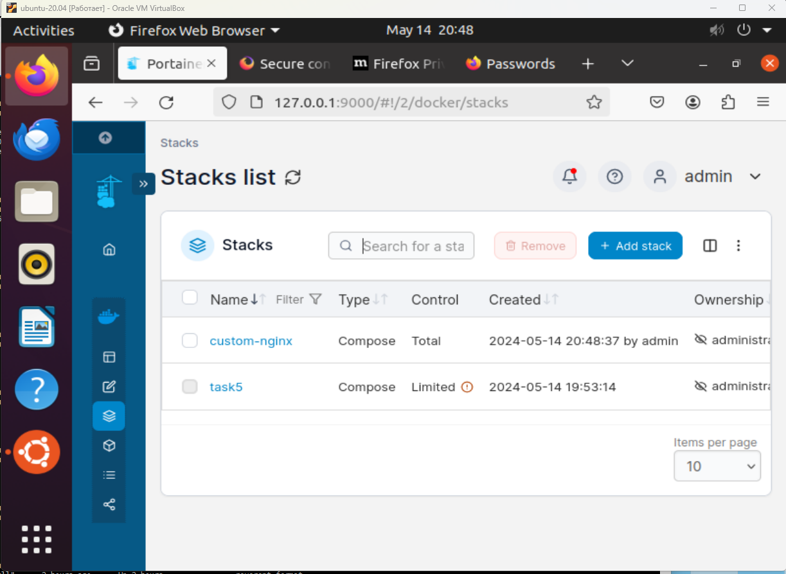
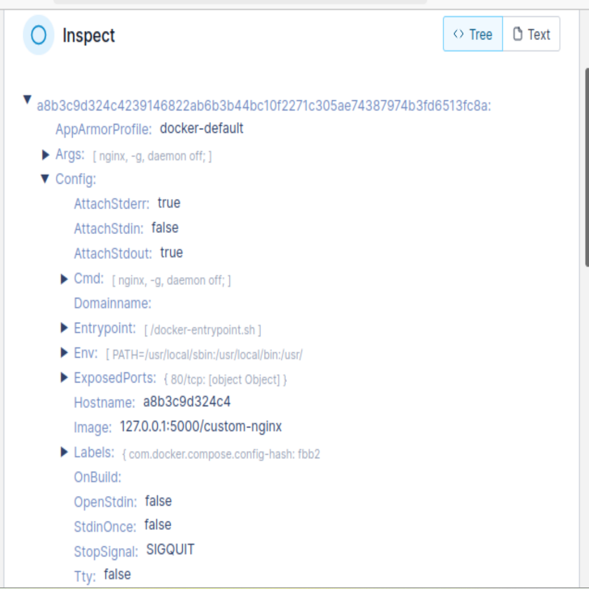
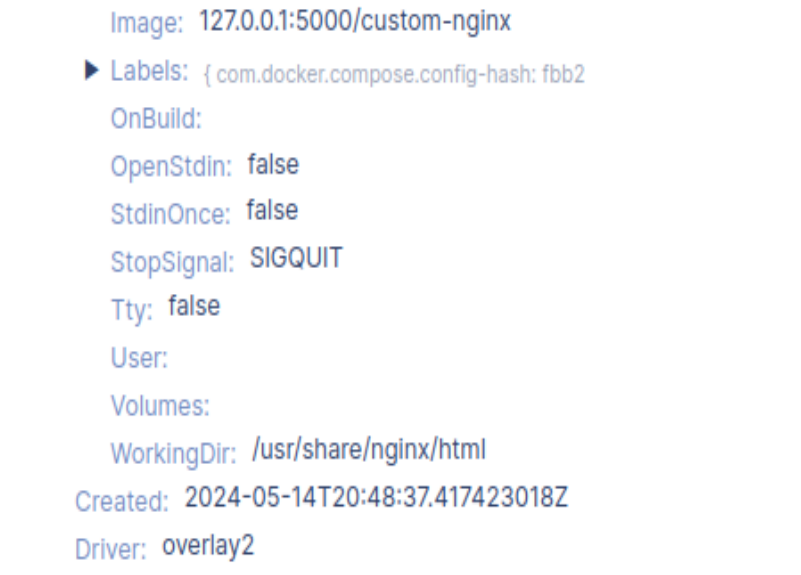
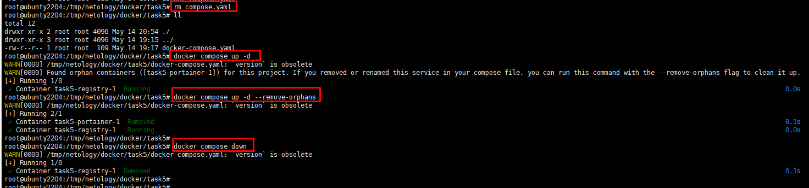

```text
Нашлись потерянные контейнеры можено запустить эту команду с флагом --remove-orphans, чтобы всё подчистить.
```

---

### Правила приема

Домашнее задание выполните в файле readme.md в GitHub-репозитории. В личном кабинете отправьте на проверку ссылку на .md-файл в вашем репозитории.


